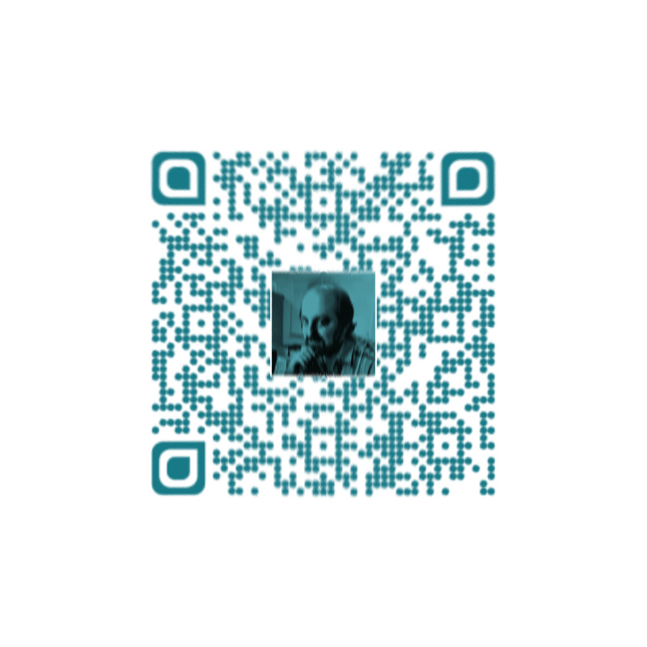

# PhotoPhone

## Task description
Open this link?
<a href=http://167.114.239.136> http://167.114.239.136</a>

Looks like simple WordPress site.


Read me!
We get that message by email from a strange man who introduced as Mr. Rijndael.
```
9wepDF8Tdabjk2CD4bpvlQwntksw8wZKfZZ58DBGnExKYgZN7Tmkv+at1Q4OLLSjdZmBzZq/HKj+
+CpehBx/3hOlEDxaXgWStwS/hQ1NLAjxw0jtloGZ95kb6C1W+ImtaVb4wgj9qHPOkLctq1jkhQNu
1k0Ly7kxF9326jnDWmhgV64UM/X3aGGRUZefLISe5rFk9PziFGxfpb2Zg53KXk6A+yvKvwsdIPTC
nNez1Ce/Mali9aYB6+ZnTyb+Y4N0vAjLjGhPU2SNnYvPNVgED86uzLgCJGXUFoiMOw5RsQTuRVYE
U7jpYvC6gE0sHyZ1nzVJ87Brbpt5a0mOKotjKbnDmYPWVPOvEjp5g4d2RFN26X3+Mytd+26E/HtV
6lsTfl5FtJjiqG7V9BGPIv6jxLsGtOFdH6gGbKOWwHaUPYsMECpTsaDw6CZ1PKgSkhD5Pc/wqEad
m5Ua2daJ+ZX+vtA3TgQFWQeR+jMnwkFQmZC/WQfXqZgNM2gUG8/zugdrrplaAp6hQ5kqutA32SIO
qeK/RvTL0lc+njVER9ItuzxofU3ATMMCCzXNY88PsfkWb/wVvYTV+3c64bRgYPiS6JKIRFrbJR+X
mWNPjg8+xn9po2KYna7iyNmIeorUcE0Tpaoz0bvH+WcZnarbuCJnRv2lKKcLlgaGoRUZurPdJFUC
O/xsnRkuIvgOTPd16Q8nmDmSo0hg6f+Cc9YIHHmyRhZRY7rqat0euAXfTXK7108ioJ9sPOpciha4
lneIvWL6sm9Whea6BzeWx0tYGck3IAWT9XQNKDKKEIsS8WYpCcJmQVC4AHR4aM95rqql40EpmUah
eXhXRny36vLML5jX8EeCEf0LaB0ELiIM5r5rWcKLiRj+v6XtBs3XDU/xrJQ0yzl4QPy0tMXQ2jU+
jIomu3uahJShR9hXnNRavQEGnY0/LYFDcRCLw+j7Oxw+amwAzGwfSjBxvuMOYm195JGmf6drrC49
hvDKeYYO1zVxgDZPBDbsrW5Vyji+A37naCIOBuFBDLxCsvs0r+2qLmnPxokkC4k10TyNK6TXB87u
dqYQDcjy/T3zZ8SmKQH9MyIAGcgOnIMqjJwkeKHiuZc5oQHYFoDoku+YgDMhya7p3SM9f6hvVwbK
HefwqF5T08CmY+3UpJ7UuQDtbZRvgOSsY3IieZ8WnnIApQO3wB/ZkmKtYOkfsFNusaclNJnnH8M6
Hoc6RKodCYM5RA1ZKzqqvW8oXD/jc0u3d3fRpgBMgeerm04q2+RUDv6mqYfCtZZZmVeTqSTOCbiY
csNi9S6e0Z4c/CcizgV35gsqtxilRDdmayR+K1Fggj3dHmZHfUarJ0D/QodgtYpLTLsRQwnW/HhM
8JNRA3ZUnNjYev6V+2+Ntd7us5lDPobx84UridJ12Ri3T7yqAnHJdp419qFp9X6/1QZKnb0ccLRU
s93P9/DXCmBgq5BH1LiduXrSx4v/ve8oA3Uc9Y2RKZMB+H3JWMXu/UvnQv3XK6z+9YneexWavdqi
1DAXSZn7lirK88L+9jY6av0hTniEMPjd5ALQHI0N5bzbV+U1fFaMZcLofLyzQz3dkI7kmjGfMa0b
gypRA8qCDL1SaglX1TplKZckcxdMYCzYKSVPrMkQPe1ciPYWcKrMndUIhCjqHM3LeNQUVY9FBKaW
WFXWLmDaDLlakY5POeQamaAnEILbb8pI5Oc/gRZhrpT3Er0DbW+zLWuMwC/MfdQ+GYvOJTNfhmjj
61jEknYF/vt0GY6/SKtZWg9brlzJtlorPKrDpdkw8p+lWuKwRVzzG1EWbo5x1XSBigSuOs3i5+Wf
ze89Cj1nGvH7hCdFqTgscYdg0Aq+yOgv85giYGWxYClLY8q+9r7+my47GyFCeBRAntkfO9Eudxrd
7w5kt0hzGtC3H6hQIHXCwvpHZosvcamD3ccmb7kA1OfWqLFsJqO3e09e8OhOENMZckXZyyTGuzhW
dBG3X49ioNPzAUlafrw/XL/YiYsXPa1o4xiP7dg/cfusPvzKT5Z3mAgIctHiPn5mt9Vy+nd4kej4
dG1b8sQb5E9DBPKWwA6Wqm3IjSOS2uBEPg91toD+5jQTD8A7G2fEpMGGwtSTEik6l1CPgJoNwk35
r07V2wUy1+ZCiv7ZS11brxQG0dUXBRYxLDaInVebZ/nW6IrW8sEER9IWFcKKLQWaToGYAoWFwhMV
zsZdBmi6MTDf2RyZz8Co2k3bn3RbqiDcG2RO25UdVaw08iqZadNwiJUpLteqFbGePhDxR3qKDHyq
82uc5ZUHHpnVrDI1bDaSJu9UPELuFsvXpEIdhFGsxF5FF9GybKfOdqVmU+gbZjwLIvmUKUmJvOjX
AqSTSX9NjuDv9b9JJoTAqcL9CFER3WaaOj6MhYo75wb6EUCqHgjpnY7zKfYLNWYDc0bIx5GzKXvn
OyMm1pSpHhr92HtjVvwrzhos3b2PyLhqdA8srhj9pDE=
```
Please help us to determine what it says in the message! We found three clues that may be relevant to it. If you can solve it and combine all parts, then you’ve obtained the keys to understand the message.


Photo of Mr. Rijndael


Some strange picture

[phone-call.wav](clues/phone-call.wav)

Phone Call to Mr. Rijndael

## Initial reconnaissance
Mr. Rijndael? 
Let's google:

*Rijndael (pronounced rain-dahl) is the algorithm that has been selected by the U.S. National Institute of Standards and Technology (NIST) as the candidate for the Advanced Encryption Standard (AES).*

Ok, looks like this text is AES encrypted. The task says that to decrypt the message I have to extract parts of the key from the clues. Maybe I can get more hints from the page source. So, lets review it. 

Looking through the page sourses I've noticed something interesting. 

2^8 WTF??? Maybe 256?
```
< img src="/wp-content/uploads/2019/06/IMG_3765-cropped-signed.png" alt="2^8"/>
```

Also, at the very bottom of the page source I've noticed small JS

```js
            if(localStorage == undefined) {
            } else {
                localStorage.setItem('IV', "rlu23Tn7RjX1vyYen8+mqQ==");
            }
```

Wow, now I have IV, that is used in block cyphers.

Combining this parts I understood that AES-256-CBC was used.

## Photo of Mr. Rijndael
I opened the image in new tab

[http://167.114.239.136/wp-content/uploads/2019/06/IMG_3765-cropped-signed.png](http://167.114.239.136/wp-content/uploads/2019/06/IMG_3765-cropped-signed.png)

Hm, signed and cropped? Where is original? It's here.

[http://167.114.239.136/wp-content/uploads/2019/06/IMG_3765.png](http://167.114.239.136/wp-content/uploads/2019/06/IMG_3765.png)

Now I have two images and of them is signed. Time to compare these images.
After spending significant time looking for comparison techniques of different size images, I found one that works perfectly.

[http://www.imagemagick.org/Usage/compare/#sub-image](http://www.imagemagick.org/Usage/compare/#sub-image)


```
compare -subimage-search IMG_3765.png IMG_3765-cropped-signed.png diff.png
```

Result:


Search what is the SingMyImage
http://signmyimage.findmysoft.com/.

I downloaded the tool, ran it on my Windows VM, opened the signed image and read the signature.

Tool returned me the link http://www.trimurl.eu/BEARDPOWER.

This link is a url shortener that does not work anymore, as support of the SingMyImage tools was finished. 

We have a key part: **BEARDPOWER**

## qrpolarcode

Word "polar" seems to be a hint. Let's search in Google words "polar imagemagick".

[http://www.imagemagick.org/Usage/distorts/](http://www.imagemagick.org/Usage/distorts/)

This documentation simply transforms into the following line.
```
convert -distort DePolar 0 -distort DePolar 0 qrpolarcode.png qr.png
```
And then flatten the png to scan with qr-scanner
```
convert -flatten qr.png qr.jpg
```


I used this scanner https://www.onlinebarcodereader.com/
It returns
```
eJzzcHT2Dgx1DQ7xd3OL8vdzDQ4NcA0KdnUOcg1x9ndxdXTx9ANhAObuC2k=
```

Base64 decode -> zlib inflate

<a href="https://gchq.github.io/CyberChef">https://gchq.github.io/CyberChef/</a>


Second part of the key: **HACKQUESTOFFZONESUPERSECRETCODEADINADIN**

## Phone-call

Let's listen the call. I hear tone number at the very beginning. Let's extract number.
```
# multimon-ng -t wav -a DTMF /tmp/phone-call.wav 
multimon-ng 1.1.7
  (C) 1996/1997 by Tom Sailer HB9JNX/AE4WA
  (C) 2012-2019 by Elias Oenal
Available demodulators: POCSAG512 POCSAG1200 POCSAG2400 FLEX EAS UFSK1200 CLIPFSK FMSFSK AFSK1200 AFSK2400 AFSK2400_2 AFSK2400_3 HAPN4800 FSK9600 DTMF ZVEI1 ZVEI2 ZVEI3 DZVEI PZVEI EEA EIA CCIR MORSE_CW DUMPCSV X10 SCOPE
Enabled demodulators: DTMF
DTMF: 1
DTMF: 5
DTMF: 5
DTMF: 5
DTMF: 6
DTMF: 2
DTMF: 7
DTMF: 4
DTMF: 5
DTMF: 6
DTMF: 9
DTMF: 8
DTMF: 2
DTMF: 4
```
Third part of the key : **15556274569824**

## Decrypting

I tried a lot of combinations to decode the message. You know that key length is 256 bits or 32 8-bit ascii symbols.
I've tried all the combinations of this length with no result.

```
"BEARDPOWERADINADIN15556274569824"
"BEARDPOWER15556274569824ADINADIN"
"ADINADINBEARDPOWER15556274569824"
"ADINADIN15556274569824BEARDPOWER"
"15556274569824BEARDPOWERADINADIN"
"15556274569824ADINADINBEARDPOWER"
```

There were no progress till the hint:

"Join three clues into one. Then use most popular algorithm to obtain the key #hint for PhotoPhone"

Hmm... Most popular alg that produses 32 bits? MD5???

I modified the PHP (task written in PHP better to solve using PHP) script that was written by [Dzmitry Savitski](https://github.com/dzmitry-savitski) to bruteforce the key.

Solver: [PhotoPhone.php](PhotoPhone.php)

After running the script the flag was obtained: 
**OfFZonE2019Here!**